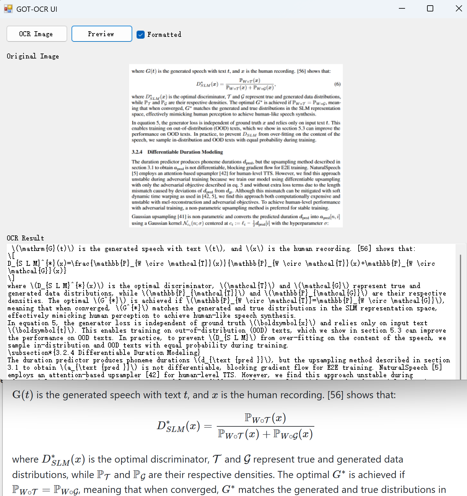

# GOT-OCR2 Windows GUI

A Windows desktop application for local optical character recognition (OCR) using the [GOT-OCR2](https://huggingface.co/stepfun-ai/GOT-OCR2_0) model. This application provides a graphical interface for converting images containing text into editable and formatted text.

Here’s a screenshot featuring the image preview at the top, followed by the OCR-extracted markdown/latex text, and the rendered text displayed below.

<a href="doc/got-ocr-ui.png"></a>


## Features

- Load and preview images
- Automatic image resizing and preprocessing
- OCR processing with GOT-OCR2 model
- Formatted text output (Markdown and Latex)
- HTML preview of formatted output
- GPU acceleration support

## Requirements

- Windows 10/11 (64-bit)
- .NET Framework 4.8
- Visual Studio 2022 (for building from source)
- GPU with Vulkan driver

## Installation and Usage

1. Download the latest release from [GitHub Releases](https://github.com/zf3/got-ocr-ui/releases)
2. Launch the got-win.exe application
3. Click "Load Image" to select an image file
4. The application will:
   - Display the original image
   - Show the preprocessed version
   - Process the image using OCR
5. View the OCR results in the text box
6. Use the "Preview" button to see formatted output
7. Check "Formatted Output" for Markdown formatting

## Building from Source

1. Clone the repository
2. Install the [Vulkan SDK](https://www.lunarg.com/vulkan-sdk/)
3. Get the following files from [release file](https://github.com/zf3/got-ocr-ui/releases) and put in `got-win/` dir: `libocr.dll`, `encoder_single.onnx`, `got_decoder-q4_k_m.gguf`
4. Open `got-win.sln` in Visual Studio 2022
5. Restore NuGet packages
6. Build the solution (x64 platform)

```
cd got-win
nuget restore
msbuild got-win.sln /p:Configuration=Release /p:Platform=x64
```

## Troubleshooting

- Ensure the model files are in the correct location
- Verify GPU drivers are up to date if using GPU acceleration
- Check console output for any error messages

## Acknowledgments

- [GOT-OCR model](https://huggingface.co/stepfun-ai/GOT-OCR2_0)
- [got.cpp](https://github.com/MosRat/got.cpp/) by MosRat


