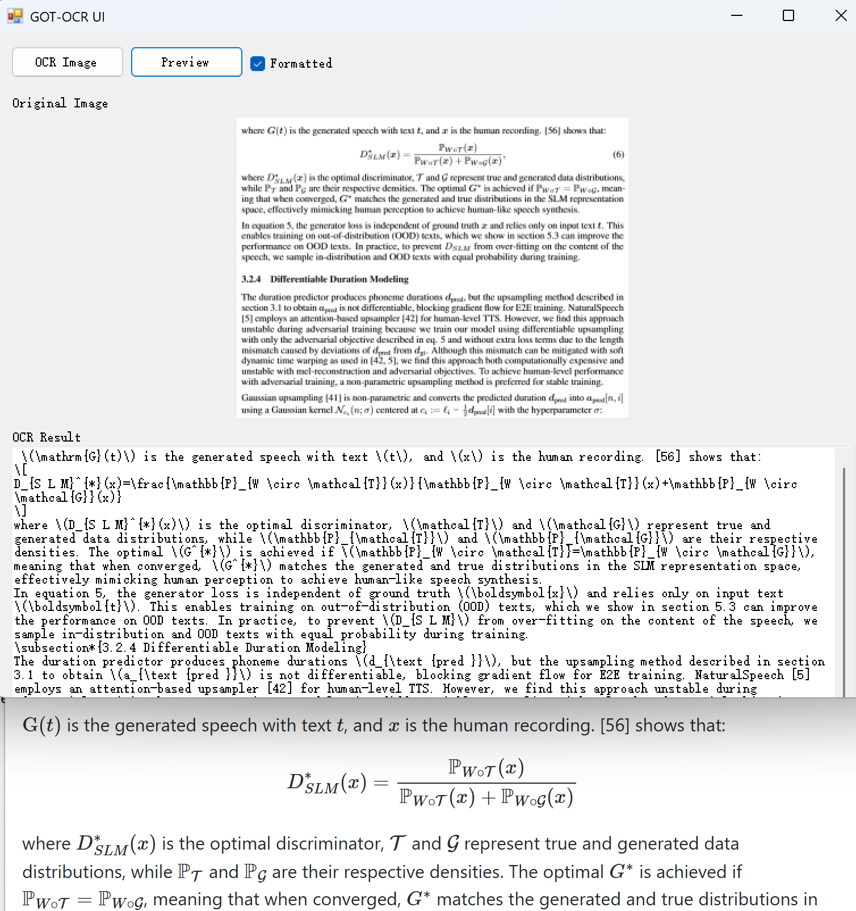

# GOT-OCR2 Windows 图形界面

一个使用 [GOT-OCR2](https://huggingface.co/stepfun-ai/GOT-OCR2_0) 模型进行本地光学字符识别（OCR）的 Windows 桌面应用程序。该应用程序提供了一个图形界面，用于将包含文本的图像转换为可编辑的格式化文本。

以下是应用程序界面的截图，顶部是图像预览，中间是 OCR 提取的 markdown/latex 文本，下方是渲染后的文本显示。

<a href="doc/got-ocr-ui.png"></a>

## 功能特性

- 加载和预览图像
- 自动图像调整大小和预处理
- 使用 GOT-OCR2 模型进行 OCR 处理
- 格式化文本输出（Markdown 和 Latex）
- HTML 格式化输出预览
- GPU 加速支持

## 系统要求

- Windows 10/11 (64位)
- .NET Framework 4.8
- Visual Studio 2022（用于从源代码构建）
- 支持 Vulkan 驱动的 GPU

## 安装与使用

1. 从 [GitHub Releases](https://github.com/zf3/got-ocr-ui/releases) 下载最新版本
2. 启动 got-win.exe 应用程序
3. 点击 "Load Image" 选择图像文件
4. 应用程序将会：
   - 显示原始图像
   - 显示预处理后的版本
   - 使用 OCR 处理图像
5. 在文本框中查看 OCR 结果
6. 使用 "Preview" 按钮查看格式化输出
7. 勾选 "Formatted Output" 查看 Markdown 格式化

## 从源代码构建

1. 克隆仓库
2. 安装 [Vulkan SDK](https://www.lunarg.com/vulkan-sdk/)
3. 从 [release 文件](https://github.com/zf3/got-ocr-ui/releases) 获取以下文件并放入 `got-win/` 目录：`libocr.dll`, `encoder_single.onnx`, `got_decoder-q4_k_m.gguf`
4. 在 Visual Studio 2022 中打开 `got-win.sln`
5. 恢复 NuGet 包
6. 构建解决方案（x64 平台）

```bash
cd got-win
nuget restore
msbuild got-win.sln /p:Configuration=Release /p:Platform=x64
```

## 故障排除

- 确保模型文件位于正确位置
- 如果使用 GPU 加速，请验证 GPU 驱动程序是否为最新版本
- 检查控制台输出以查看错误信息

## 致谢

- [GOT-OCR 模型](https://huggingface.co/stepfun-ai/GOT-OCR2_0)
- MosRat 的 [got.cpp](https://github.com/MosRat/got.cpp/)
